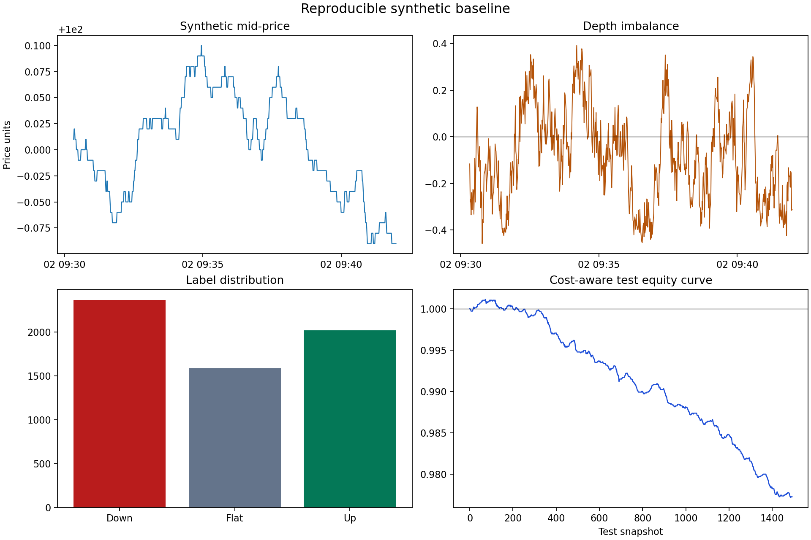

# Market Microstructure Trading Research

A clean-room Python research project for limit-order-book feature engineering,
leakage-aware classification, and transparent cost-aware backtesting. The repository uses
deterministic synthetic Level-2 data so the complete workflow is reproducible and safe to
publish as a professional portfolio project.

> Research and educational software only. It is not investment advice, a live-trading
> system, or evidence of performance in real markets.

## What this project demonstrates

- Reproducible synthetic L2 order-book generation with configurable depth and random seed
- Validated spread, depth, weighted-midprice, trade-flow, and order-flow features
- Explicit separation of causal features from forward-looking labels
- Chronological train/test evaluation with a scikit-learn pipeline
- One-snapshot execution delay, turnover, transaction costs, and drawdown reporting
- Automated tests, continuous integration, safety scanning, and a documented data policy

## Workflow

    Synthetic L2 snapshots
             |
             v
    Schema and book validation
             |
             v
    Causal feature engineering ----> Future label construction
             |                              |
             +--------------+---------------+
                            v
                 Chronological train/test split
                            |
                            v
                 Logistic-regression baseline
                            |
                            v
              Delayed, transaction-cost backtest

## Reproducible baseline

The committed result is generated from 6,000 synthetic snapshots with seed
42. On the final chronological holdout, the baseline produced:

| Diagnostic | Value |
|---|---:|
| Test observations | 1,493 |
| Accuracy | 0.500 |
| Balanced accuracy | 0.466 |
| Macro F1 | 0.448 |
| Net synthetic return after 1 bp turnover cost | -2.273% |
| Maximum drawdown | -2.391% |

These values are pipeline diagnostics on deliberately structured synthetic data. They must
not be interpreted as a forecast of real-market or live-trading performance.

## Quick start

    python -m venv .venv
    .venv\Scripts\activate
    python -m pip install -e .[dev]
    python scripts/run_experiment.py
    python -m pytest -q
    python scripts/check_repository.py

On macOS or Linux, activate the environment with source .venv/bin/activate.

The narrative analysis is in
[notebooks/01_market_microstructure_research.ipynb](notebooks/01_market_microstructure_research.ipynb).

## Repository map

| Path | Purpose |
|---|---|
| src/market_microstructure | Reusable generator, features, labels, model, and backtest |
| notebooks | End-to-end research narrative |
| tests | Determinism, feature math, leakage, and cost tests |
| data/sample_lob.csv | Small inspectable synthetic sample |
| results | Reproducible metrics and figure |
| DATA_POLICY.md | Rules that prevent confidential or licensed data exposure |
| CLEAN_ROOM.md | Provenance and independent-implementation statement |

## Methodology notes

The weighted_midprice feature is the static top-of-book quote weighted by opposite-side
displayed size. Order-flow imbalance follows the event-accounting definition described by
Cont, Kukanov, and Stoikov. The baseline is intentionally interpretable and lightweight;
DeepLOB is cited as relevant future work, not reproduced here.

Important limitations include synthetic data, snapshot rather than message-level dynamics,
no queue-position model, no partial fills, and a simple cost assumption. See
[REFERENCES.md](REFERENCES.md) for sources and [DATA_POLICY.md](DATA_POLICY.md) before adding
any data.

## License

MIT. See [LICENSE](LICENSE).
